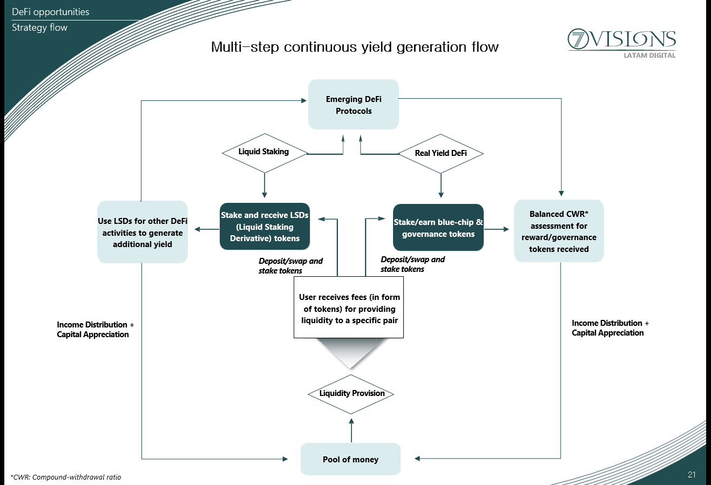

# Team

<table data-header-hidden><thead><tr><th></th><th width="374"></th></tr></thead><tbody><tr><td></td><td></td></tr><tr><td>
<a href="https://www.linkedin.com/in/nascimentoalex/"><mark style="color:purple;"><strong>ALEX NASCIMENTO</strong></mark></a>

Co-founder of 7Visions and 7CC Blockchain Investments. He is faculty at UCLA and authored the bestselling book; The STO FINANCIAL REVOLUTION demystifying STOs. Co-founded the UCLA Blockchain Lab and is a member of the UCLA Blockchain Advisory Board. He holds an MBA from UCLA Anderson School of Management and has advised companies in the United States, EU, Latin America, and Asia on marketing &#x26; Blockchain strategies. 
</td><td>
<mark style="color:purple;"><strong>AMAURY JUNIOR</strong></mark>

Co-founder of 7Visions and Vision Brazil. Prior to that, Amaury was Managing Director, Head Trader and Treasurer for Bank of America in Brazil. Also, held senior positions at JP Morgan in NY and Brazil. Amaury is a member of the advisory board of Cedar Bridge Partners, a private equity firm focused on the Middle East and North Africa regions, and holds seats in the Board of Directors of several companies. He holds a Ph.D. from MIT.

</td></tr><tr><td> </td><td></td></tr><tr><td>
<a href="https://www.linkedin.com/in/fabio-greco-14649612a/"><mark style="color:purple;"><strong>FABIO GRECO</strong></mark></a>

Co-founder of 7Visions and Vision Brazil. Also, former Head of Derivatives Trading Desk of Bank of America in Brazil. Prior to Bank of America, he spent two years at Banco Patrimonio (subsidiary of Salomon Brothers), leading the derivatives and proprietary trading desks. He holds an MBA from IMD in Switzerland and a B.A. from FGV in São Paulo.    

</td><td>
<a href="https://www.linkedin.com/in/macieltony/"><mark style="color:purple;"><strong>TONY MACIEL</strong></mark></a>

Co-founder of 7Visions and 7CC Blockchain Investments. Previously, Tony held senior positions at Lehman Brothers and Merrill Lynch in the areas of Investment Banking, Sales and Trading and Asset Management. Also, was an alternative assets portfolio manager at Lyxor Asset Management. At Lehman Brothers, he was a member of the International Directors Council. Holds a degree from Boston University in International Finance.

 

</td></tr><tr><td> </td><td></td></tr><tr><td>
<a href="https://www.linkedin.com/in/chow-h-juei-61258a1/"><mark style="color:purple;"><strong>CHOW H. JUEI</strong></mark></a>

Partner at Vision Brazil. Formerly, partner and portfolio manager of credit, real estate funds and wealth management at Jera Capital. Also, he was an equities and multi-strategy portfolio manager at Necton Investimentos (BTG Pactual) and worked at Merrill Lynch’s private equity group for Latin America. He holds an MBA from The University of Chicago Booth School of Business.

 

</td><td>
<a href="https://www.linkedin.com/in/gustavo-r-torrecilha-606784283/"><mark style="color:purple;"><strong>GUSTAVO TORRECILHA</strong></mark></a>

<code>tbt</code>

</td></tr><tr><td> </td><td></td></tr><tr><td>
TBtttt

<code>tbt</code>

TBT

</td><td>
TBT

<code>tbt</code>

TBT
</td></tr><tr><td></td><td></td></tr><tr><td>
TBT

<code>tbt</code>

TBT
</td><td>
TBT

<code>tbt</code>

TBT   
</td></tr><tr><td></td><td></td></tr><tr><td>
TBT

<code>tbt</code>

TBT .
</td><td>
TBT

<code>tbt</code>

TBT
</td></tr></tbody></table>

